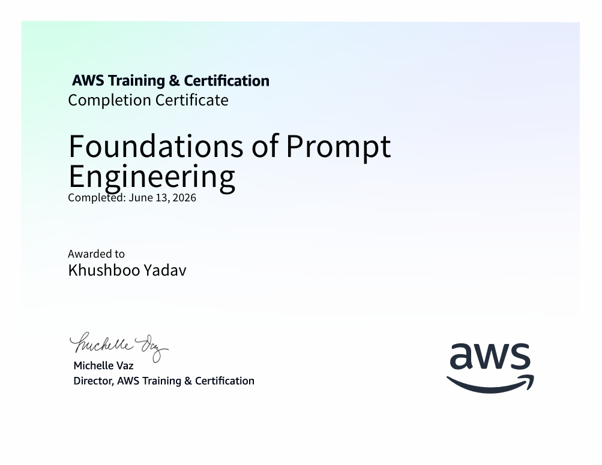
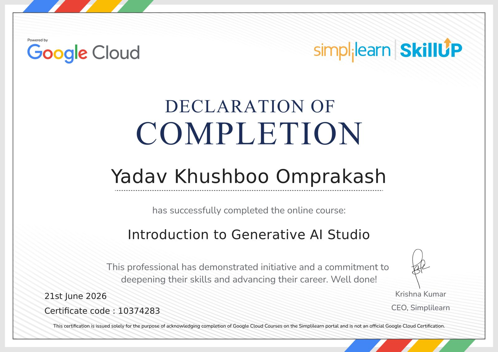
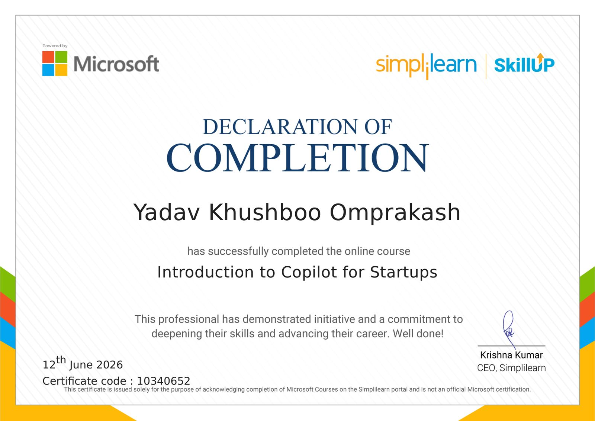
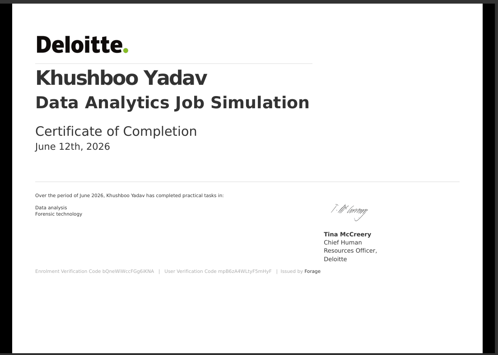
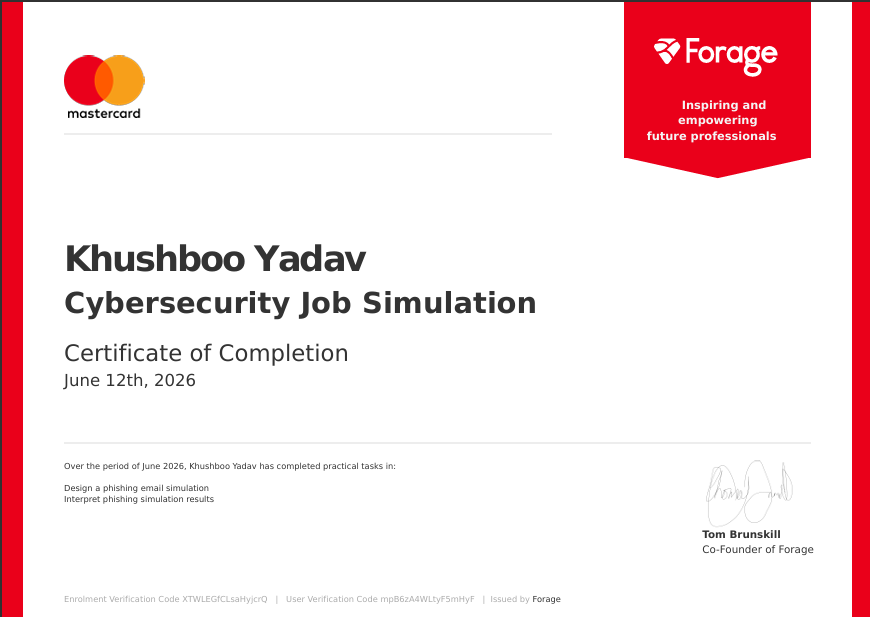
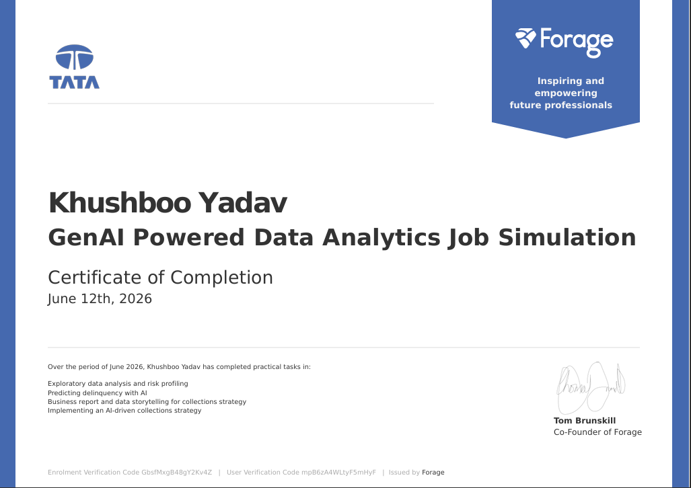
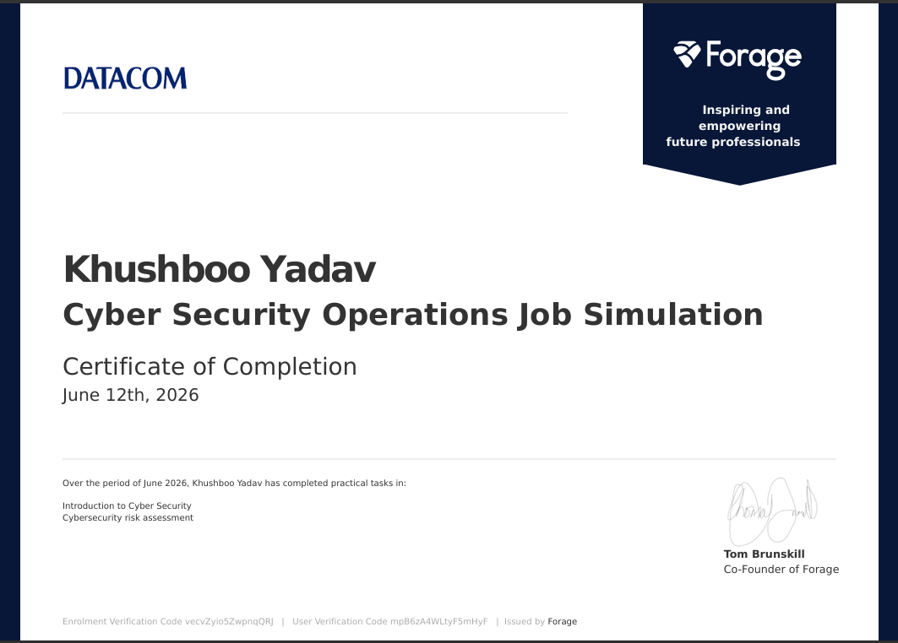
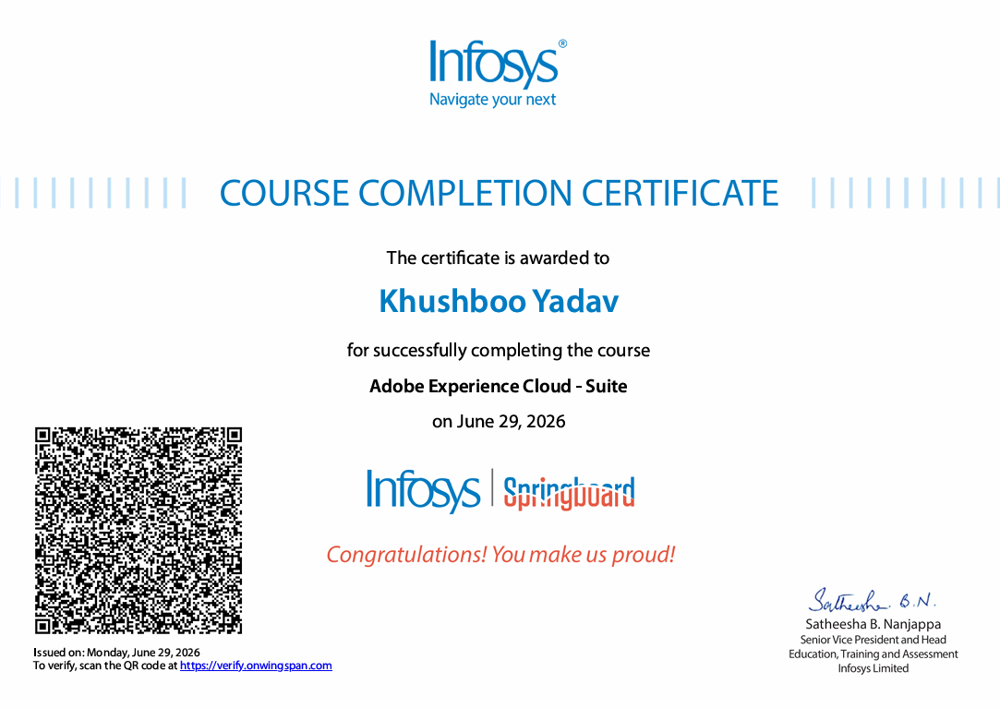

<!--
</p>-->
<p align="center">
  
  
</p>
<br clear="all" />

<h3 align="center">
Building Scalable Full Stack Applications while Exploring Artificial Intelligence & Machine Learning
</h3>

<p align="center">


</p>

---

<p align="center">


<!---->

</p>

<p align="center">

<a href="https://www.linkedin.com/in/khushbooo-yadav-4b8449322">

</a>

<a href="mailto:y08.khushboo@gmail.com">

</a>

<a href="https://github.com/khushboo-yadav28">

</a>

</p>

<p align="center">


</p>

---

# 👩‍💻 About Me

I am an **Integrated M.Sc. Information Technology** student passionate about building modern, scalable, and user-focused software solutions.

My interests span **Full Stack Development**, **Artificial Intelligence**,**Next-Gen AI**,**Cyber Security**, and **Machine Learning**, where I enjoy transforming real-world ideas into practical applications using modern technologies.

I have experience developing enterprise-inspired applications using **Angular 19**, **Node.js**, **Express.js**, **Django**, and **MongoDB**, while continuously exploring emerging areas such as **Agentic AI**, **Computer Vision**, and **Data Analytics**.

Beyond academics, I actively participate in technical competitions, hackathons, and hands-on projects that strengthen my software engineering and problem-solving skills.

---

# 🚀 Open To

- 💼 Software Development Internship
- 🌐 Full Stack Developer Internship
- 🤖 AI / Machine Learning Internship
- 📱 Web Application Development
- ☁ Cloud & Backend Engineering
- 🚀 Open Source Collaboration

---

# 🛠 Tech Stack

## 💻 Languages

<p align="left">


</p>

---

## 🎨 Frontend

<p>


</p>

---

## ⚙ Backend & APIs

<p>


<!---->

</p>

---

## 🗄 Databases

<p>


</p>

---

## 🤖 AI • Machine Learning • Data

<p>


</p>

- Machine Learning
- Computer Vision
- CNN
- Sentiment Analysis
- Agentic AI
- Data Visualization

---

## ☁ Cloud • DevOps • Tools

<p>


</p>

---

## 💡 Current Interests

- 🤖 Agentic AI
- 🧠 Machine Learning
- 👁 Computer Vision
- 📊 Data Analytics
- 🌐 Full Stack Development
- ☁ Cloud Computing
- 🚀 Open Source
- <!-- ===================================================== -->
<!--              AI / ML EXPERTISE                        -->
<!-- ===================================================== -->

# 🤖 AI / Machine Learning Expertise

<table align="center">
<tr>
<th width="22%">Domain</th>
<th width="18%">Level</th>
<th>Description</th>
</tr>

<tr>
<td><b>Machine Learning</b></td>
<td>Intermediate</td>
<td>Developing predictive models using Scikit-learn and TensorFlow while exploring practical ML applications.</td>
</tr>

<tr>
<td><b>Computer Vision</b></td>
<td>Intermediate</td>
<td>Building OpenCV-based applications including Hand Gesture Recognition, OCR, and image processing solutions.</td>
</tr>

<tr>
<td><b>Natural Language Processing</b></td>
<td>Intermediate</td>
<td>Working on Speech-to-Text systems, Sentiment Analysis, and AI-assisted language applications.</td>
</tr>

<tr>
<td><b>Agentic AI</b></td>
<td>Learning</td>
<td>Exploring autonomous workflows, intelligent agents, and multi-agent orchestration concepts.</td>
</tr>

<tr>
<td><b>Data Analytics</b></td>
<td>Intermediate</td>
<td>Data visualization, preprocessing, and analysis using Python, Pandas, and NumPy.</td>
</tr>

</table>

---

# 🚀 Featured Projects

---

<details>
<summary>

# 📦 Inventory Control System

Enterprise Inventory Management using the **MEAN Stack**

</summary>

<br>

### 📖 Overview

A scalable inventory management system built to simplify stock management, purchase tracking, and administrative workflows.

---

| Feature | Description |
|---------|-------------|
| **Tech Stack** | Angular 19, Node.js, Express.js, MongoDB, Mongoose, TypeScript |
| **Architecture** | MEAN Stack |
| **Authentication** | JWT Authentication |
| **Authorization** | Role Based Access Control (RBAC) |
| **Database** | MongoDB |
| **API** | RESTful APIs |
| **Dashboard** | Real-time Inventory Analytics |

### ⭐ Highlights

- Responsive Angular 19 frontend using Signals
- RESTful backend with Express.js
- Secure JWT Authentication
- Role Based Access Control
- Purchase Order Management
- Low Stock Notifications
- Inventory Dashboard
- Audit Logs
- MongoDB with Mongoose ODM

### 📌 Repository

```text
Coming Soon
```

</details>

---

<details>
<summary>

# 📝 Dynamic Blog Platform

Full Stack Django Blogging Platform

</summary>

<br>

### 📖 Overview

A complete blogging application built using Django and Django REST Framework with authentication and REST APIs.

---

| Feature | Description |
|---------|-------------|
| **Backend** | Django |
| **API** | Django REST Framework |
| **Frontend** | Bootstrap |
| **Database** | SQLite |
| **Authentication** | Django Authentication |
| **Architecture** | MVC |

### ⭐ Features

- User Registration & Login
- CRUD Operations
- Category Management
- Comment System
- Like System
- User Profiles
- Session Tracking
- Cookies
- REST APIs
- Search Functionality

### 📌 Repository

```text
Coming Soon
```

</details>

---

<details>
<summary>

# 🤖 AI Mini Projects

Daily Python + AI Learning Projects

</summary>

<br>

### Projects

| Project | Technology |
|---------|------------|
| 👋 Hand Gesture Recognition | Python, OpenCV, MediaPipe |
| 🎤 Speech to Text | Python, SpeechRecognition |
| 🖼 OCR | OpenCV, EasyOCR |
| 😊 Face Detection | OpenCV |
| 😀 Emotion Detection | Deep Learning |
| 🖱 Virtual Mouse | MediaPipe |
| 🧠 Image Classification | CNN |
| 📊 Data Visualization | Pandas, Matplotlib |

### Purpose

I build small AI applications regularly to strengthen my Python programming, Computer Vision, and Machine Learning skills through hands-on practice.

</details>

---

<details>
<summary>

# 📊 Data Analytics Projects

Python Data Analysis

</summary>

<br>

### Technologies

- Python
- Pandas
- NumPy
- Matplotlib
- Excel
- CSV

### Topics

- Data Cleaning
- Data Visualization
- Exploratory Data Analysis
- Statistical Analysis
- Dashboard Development

</details>

---

<details>
<summary>

# 🔮 Upcoming Projects

Currently Planning

</summary>

<br>

- 🤖 AI Voice Assistant
- 🚗 Vehicle Number Plate Detection
- 🎥 Real-Time Object Detection
- 📄 Resume Analyzer using AI
- 🧠 AI Interview Assistant
- 💬 Chatbot with LLM
- 📷 Face Attendance System
- 🛒 Smart Inventory using AI
- 🌿 Plant Disease Detection
- 📚 AI Notes Summarizer

</details>

---

# 💼 Project Timeline

| Year | Project |
|------|---------|
| 2025 | Dynamic Blog Platform |
| 2026 | Inventory Control System |
| 2026 | AI Mini Projects |
| Ongoing | Machine Learning & Agentic AI |

---

# 📈 Development Philosophy

> **"Every project is an opportunity to learn something new."**

I enjoy building software that combines clean architecture, responsive user experiences, and practical AI solutions. My focus is on writing maintainable code, learning modern technologies, and continuously improving through real-world projects.

---<!-- ===================================================== -->
<!--                EDUCATION & EXPERIENCE                 -->
<!-- ===================================================== -->

# 🎓 Education

<table align="center">
<tr>
<th>Qualification</th>
<th>Institute</th>
<th>Duration</th>
<th>Performance</th>
</tr>

<tr>
<td><b>Integrated M.Sc. Information Technology</b></td>
<td>GLS University, Ahmedabad</td>
<td>2022 – Present</td>
<td>Currently in Semester IX</td>
</tr>

<tr>
<td><b>B.Sc. Information Technology</b></td>
<td>Faculty of Computer Applications & Information Technology (FCAIT), GLS University</td>
<td>2022 – 2025</td>
<td><b>8.9 CGPA • 5th Department Rank</b></td>
</tr>

</table>

---

<!--# 💼 Experience

> Although I am currently a Master's student, I have gained practical software engineering experience by developing full-stack applications, AI solutions, and participating in state-level technical competitions.

----->

### 👩‍💻 Full Stack Developer

**Academic & Personal Projects**

**June 2025 – Present**

#### Responsibilities

- Developed enterprise-grade web applications using Angular 19, Node.js, Express.js and MongoDB.
- Built secure RESTful APIs with Django REST Framework.
- Implemented JWT Authentication and Role Based Access Control (RBAC).
- Designed responsive user interfaces using Bootstrap and Angular.
- Worked on database modelling using MongoDB and SQLite.
- Developed AI-powered applications using Python and OpenCV.
- Practiced modern software engineering principles including modular architecture and reusable components.

#### Technologies

<p>


</p>

---

### 🤖 AI & Machine Learning Projects

**Self Learning • Continuous**

#### Areas

- Computer Vision
- Machine Learning
- OpenCV Applications
- CNN Models
- Speech Recognition
- OCR Systems
- Sentiment Analysis
- Agentic AI

#### Technologies

<p>


</p>

---

# 🏆 Achievements

<table align="center">

<thead>

<tr>

<th width="30%">Recognition</th>

<th>Achievement</th>

</tr>

</thead>

<tbody>

<tr>

<td>

🥈 <b>2nd Prize</b>

<br>

Tech Fest 2026

</td>

<td>

State-Level Poster Presentation organized by the

Post Graduate Department of Computer Science & Technology,

Sardar Patel University.

Presented an innovative technical solution and secured

Second Position among participating teams.

</td>

</tr>

<tr>

<td>

🥉 <b>3rd Prize</b>

<br>

Cyber Shadez 2026

</td>

<td>

Awarded Third Prize at GLS University's technical event

for presenting an innovative poster on

<b>Agentic Artificial Intelligence.</b>

</td>

</tr>

<tr>

<td>

🏅 <b>Academic Excellence</b>

</td>

<td>

Graduated B.Sc. IT with

<b>8.9 CGPA</b>

and secured

<b>5th Department Rank</b>

at FCAIT.

</td>

</tr>

</tbody>

</table>

---


# 📜 Certifications

> Click on any certificate to view it in full size.

---

<details>
<summary><b>☁ AWS Training & Certification — Foundations of Prompt Engineering</b></summary>

<br>

<a href="./certificates/AWS_Certificate.png">

</a>

</details>

---

<details>
<summary><b>☁ Microsoft Azure — Azure Fundamentals: Cloud Computing</b></summary>

<br>

<a href="./certificates/Azure%20Fundamentals_%20Cloud%20Computing%20(1).png">

</a>

</details>

---

<details>
<summary><b>☁ Google Cloud — Create Your First Gemini Application</b></summary>

<br>

<a href="./certificates/GoogleCloud.png">

</a>

</details>

---

<details>
<summary><b>☁ Google Cloud — Generative AI Leader: GenAI Landscape and Use Cases</b></summary>

<br>

<a href="./certificates/Google%20Cloud%20Generative%20AI%20Leader_%20GenAI%20Landscape%20and%20Use%20Cases.png">

</a>

</details>

---

<details>
<summary><b>💻 Microsoft Learn — Explore and Analyze Data with Python</b></summary>

<br>

<a href="./certificates/Microsoft.png">

</a>

</details>

---

<details>
<summary><b>📊 Deloitte Australia — Data Analytics Job Simulation</b></summary>

<br>

<a href="./certificates/Data_Analytics_Deloitte_Certificate.png">

</a>

</details>

---

<details>
<summary><b>💳 Mastercard — Cybersecurity Job Simulation</b></summary>

<br>

<a href="./certificates/Mastercard_cybersecurity_certificate.png">

</a>

</details>

---

<details>
<summary><b>🤖 Tata — GenAI Powered Data Analytics</b></summary>

<br>

<a href="./certificates/GenAI_Powered_Data_Analytics_Tata_Certificate.png">

</a>

</details>

---

<details>
<summary><b>🛡 DataCom — Cyber Security Operations</b></summary>

<br>

<a href="./certificates/Cyber_Security_Operations_DataCom_Certificate.png">

</a>

</details>

---

<details>
<summary><b>🎨 Adobe Creative Cloud Suite — Infosys Springboard</b></summary>

<br>

<a href="./certificates/Adobe_Cloud_Suite_Infosys.png">

</a>

</details>

---

<details>
<summary><b>☁ Cloud Technologies — Infosys Springboard</b></summary>

<br>

<a href="./certificates/Cloud_Technologies_Infosys.png">

</a>

</details>

---

<details>
<summary><b>📚 Udemy Learning Certificate — Infosys Springboard</b></summary>

<br>

<a href="./certificates/Udemy%20_%20infosys_certificate.png">

</a>

</details>

---

# 🌟 Highlights

✔ Full Stack Development

✔ Angular 19

✔ Django REST Framework

✔ Node.js & Express.js

✔ MongoDB

✔ REST API Development

✔ JWT Authentication

✔ Machine Learning

✔ Computer Vision

✔ Agentic AI

✔ Data Analytics

✔ Software Engineering

✔ Continuous Learning


<!-- ===================================================== -->
<!--                 GITHUB ANALYTICS                      -->
<!-- ===================================================== -->

<!--# 📊 GitHub Analytics

<p align="center">


</p>-->

---

# 🔥 GitHub Streak

<p align="center">


</p>

---

# 📈 GitHub Profile Summary

<p align="center">


</p>

<p align="center">


</p>

<p align="center">


</p>

---

<!--# 🏆 GitHub Trophies

<p align="center">


</p>

---
-->
# 📈 Contribution Activity

<p align="center">


</p>

---

# 🐍 Contribution Snake

<p align="center">


</p>

---

# 🚀 Current Focus

```yaml
education:
  - Integrated M.Sc. Information Technology

currently_building:
  - AI Mini Projects
  - Inventory Management Applications
  - Computer Vision Projects
  - Django REST APIs

currently_learning:
  - Agentic AI
  - Machine Learning
  - Advanced Angular
  - Cloud Technologies
  - Software Architecture

interested_in:
  - Artificial Intelligence
  - Full Stack Development
  - Computer Vision
  - Data Analytics
  - Backend Engineering

open_to:
  - Software Development Internships
  - Full Stack Developer Roles
  - AI / ML Opportunities
  - Open Source Collaboration

goal_2026:
  - Build impactful AI applications
  - Contribute to Open Source
  - Strengthen Data Structures & Algorithms
  - Grow as a Software Engineer
```

---

# 💡 Developer Philosophy

> **"Great software is not only about writing code—it's about solving real-world problems with simplicity, scalability, and continuous learning."**

---

# 🌐 Connect With Me

<p align="center">

<a href="mailto:y08.khushboo@gmail.com">

</a>

<a href="https://www.linkedin.com/in/khushbooo-yadav-4b8449322">

</a>

<a href="https://github.com/khushboo-yadav28">

</a>

<!-- Uncomment when you have a portfolio website -->
<!--
<a href="https://your-portfolio.com">

</a>
-->

</p>

---

# 💜 Support My Work

<p align="center">

⭐ If you enjoy my projects, consider giving them a star.

🤝 I'm always open to collaborating on exciting Full Stack and AI projects.

📬 Feel free to connect if you'd like to discuss technology, internships, or open-source contributions.

</p>

---

<p align="center">


</p>

<p align="center">

### Thanks for visiting my profile! 👋

**"Keep learning, keep building, and let your work speak for itself."**

</p>

